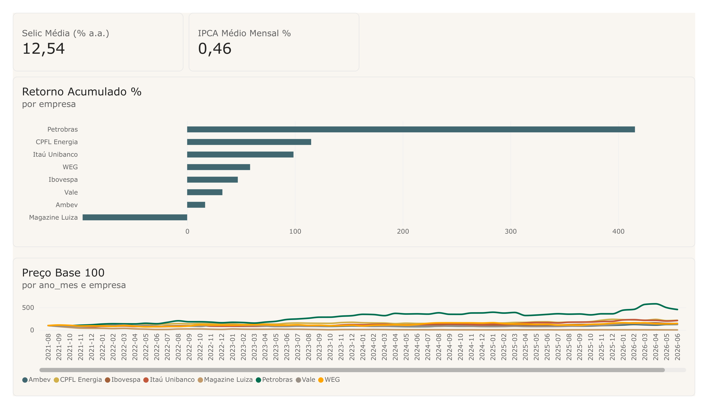
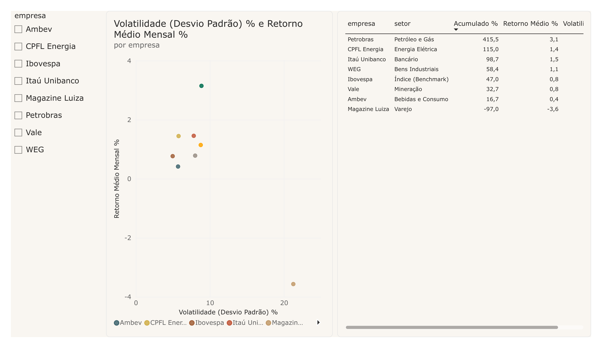
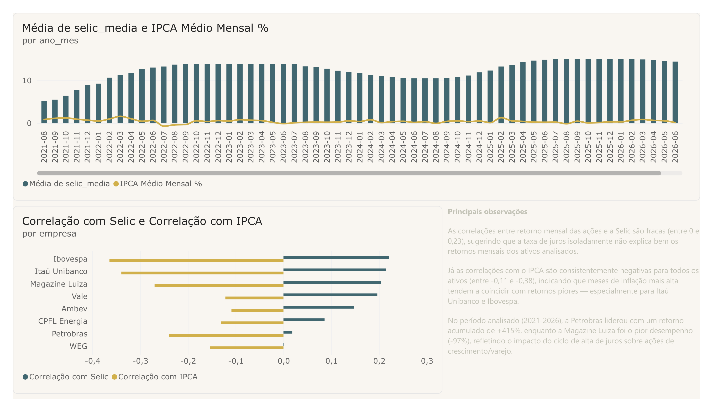

# Dashboard Bolsa x Macroeconomia

## Objetivo
Construir um dashboard em Power BI que analisa o desempenho histórico de ações da B3 e sua relação com indicadores macroeconômicos (Selic, IPCA), usando um pipeline em Python para extração e tratamento dos dados — com o objetivo de identificar padrões entre cenário macro e comportamento de ações.

## Fontes de Dados
- **Cotações de ações (B3):** Yahoo Finance, via biblioteca yfinance. Período: 2021-08-30 a 2026-08-26 (5 anos, dados diários).
  - Ativos: PETR4, VALE3, ITUB4, WEGE3, MGLU3, ABEV3, CPFE3, e o índice Ibovespa (^BVSP)
- **Selic:** Banco Central do Brasil, API SGS (série 432 - Meta Selic), dados diários.
- **IPCA:** Banco Central do Brasil, API SGS (série 433 - variação mensal), dados mensais.

## Modelo de Dados
Modelo em estrela no Power BI:
- **fato_retornos**: retornos mensais, preços, Selic e IPCA por ativo/mês
- **dim_ativos**: ticker, empresa, setor
- **dim_datas**: ano_mes, ano, mês

Principais medidas DAX: Retorno Acumulado %, Retorno Médio Mensal %, Volatilidade (Desvio Padrão), Selic Média, IPCA Médio Mensal, Preço Base 100 (normalizado para comparação entre ativos).

## Páginas do Dashboard

### 1. Visão Geral

KPIs de contexto macro (Selic e IPCA médios do período), ranking de retorno acumulado por ativo (ordenado do maior para o menor), e evolução dos preços normalizados em base 100 para comparar ativos de escalas de preço diferentes na mesma visualização.

### 2. Comparativo entre Ações

Segmentação por ativo, gráfico de dispersão risco x retorno (Volatilidade vs. Retorno Médio Mensal, uma bolha por ativo), e tabela detalhada com todas as métricas lado a lado (empresa, setor, retorno acumulado, retorno médio, volatilidade).

### 3. Ações x Macro

Gráfico combinado mostrando a evolução da Selic (barras) e do IPCA (linha) ao longo do período, gráfico de correlação (Selic e IPCA) por ativo, e observações finais consolidando os principais achados da análise.

## Principais Conclusões

- **Petrobras liderou o período com retorno acumulado de +415%**, enquanto a **Magazine Luiza teve o pior desempenho (-97%)**, refletindo o impacto do ciclo de alta de juros sobre ações de crescimento/varejo.
- As **correlações entre retorno mensal das ações e a Selic são fracas** (entre 0 e 0,23), sugerindo que a taxa de juros isoladamente não explica bem os retornos mensais dos ativos analisados.
- As **correlações com o IPCA são consistentemente negativas** para todos os ativos analisados (entre -0,11 e -0,38), indicando que meses de inflação mais alta tendem a coincidir com retornos piores — especialmente para Itaú Unibanco e Ibovespa.
- A **Magazine Luiza apresentou a maior volatilidade** (21,3% de desvio padrão mensal), consistente com seu desempenho negativo no período.

## Status do projeto
✅ Concluído — dashboard com 3 páginas, pipeline de dados em Python, modelo em estrela no Power BI e 8 medidas DAX.

## Estrutura do repositório
- `data/raw` — dados brutos, como extraídos da fonte
- `data/processed` — dados tratados, prontos para o Power BI
- `src` — scripts Python de extração e tratamento
- `dashboard` — arquivo .pbix do Power BI
- `docs` — documentação e prints do dashboard

## Tecnologias
- Python (Pandas, yfinance)
- Power BI
- Git/GitHub

## Como Reproduzir
1. Clone o repositório
2. Instale as dependências: `pip install -r requirements.txt`
3. Rode `src/ingestao_dados.py` para baixar os dados brutos (ações via yfinance, Selic/IPCA via API do Banco Central)
4. Rode `src/tratamento_dados.py` para gerar a base tratada
5. Rode `src/preparar_modelo_powerbi.py` para gerar as tabelas do modelo em estrela
6. Abra `dashboard/dashboard_bolsa_macro.pbix` no Power BI Desktop

## Autor
Lucas — estudante de Ciência da Computação (UNINTER), em transição de Operações para Dados/Analytics.
